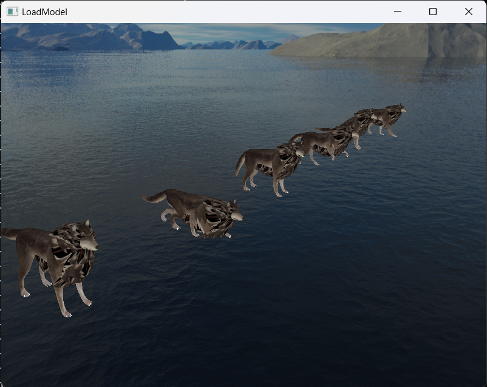

# 骨骼蒙皮模型加载示例

本项目是基于学习 **Joey de Vries**  和 **ogldev** 教程的个人练手项目，主要涵盖了模型加载以及骨骼蒙皮部分的实现。

# 项目说明

在学习 Joey de Vries 的教程时，我发现在加载模型的部分并未涵盖骨骼蒙皮的介绍。因此，我在学习了 ogldev 的相关内容后，将两者结合，完善了加载模型动作部分。

项目中模型来源：[Dennis Haupt (3dhaupt) Wolf](https://free3d.com/user/3dhaupt)

# 使用方法

- 下载本仓库到本地文件

- 用visual studio打开并编译运行

# 示例截图

